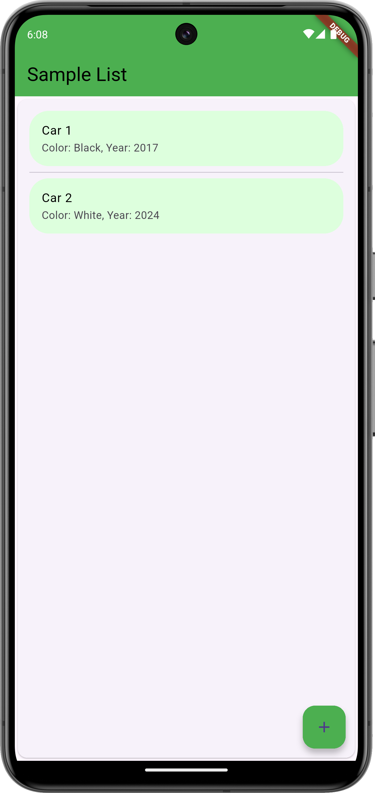
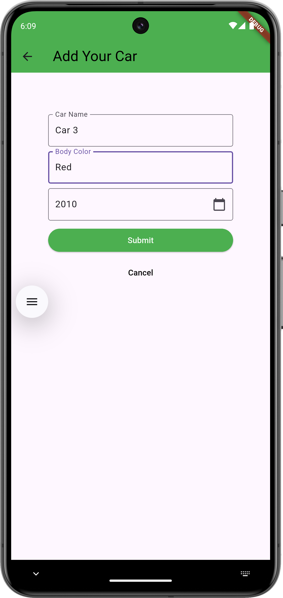
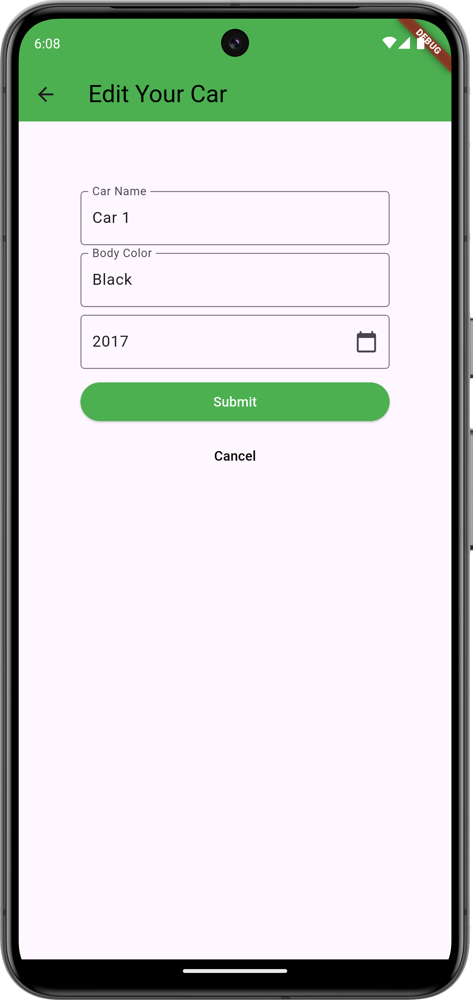

# Sample List

**sample_list** is a Flutter app for exploring local data management using the powerful [Isar Database](https://isar.dev/).  
It provides a simple, customizable interface for creating and managing item lists - perfect for learning or as a starter template for your own applications.

- 📦 Built with **Isar DB**  
- 🌐 View database content from your browser  
- 🚀 Planning to integrate **Riverpod** and **GoRouter**

## 📚 Table of Contents

- [Features](#features)
- [Screenshots](#screenshots)
- [Getting Started](#getting-started)
  - [Requirements](#requirements)
  - [Installation](#installation)
  - [Customizing Models](#customizing-models)
- [Usage](#usage)
- [Roadmap](#roadmap)
- [License](#license)

## ✨ Features

- **Local-first storage** using [Isar](https://isar.dev/) — fast, reactive, and schema-based.
- **Browser inspection**: Use [Isar Inspector](https://isar.dev/inspector.html) to view data in your browser.
- **Customizable models**: Tailor your data models (e.g., cars, tasks, books) to suit your needs.
- **Simple UI**: Clean layout with list creation, editing, and deletion.
- **Flutter Slidable integration** for intuitive swipe actions.

## 📸 Screenshots

Here are some screenshots of the app in action

<p align="center">
  
  
  
</p>


## 🚀 Getting Started

### Requirements

Make sure you have Flutter and the following packages:

- [`isar`](https://pub.dev/packages/isar)
- [`intl`](https://pub.dev/packages/intl)
- [`flutter_slidable`](https://pub.dev/packages/flutter_slidable)

### Installation

```bash
git clone https://github.com/tomgly/sample-list.git
cd sample-list
flutter pub get
```

### Customizing Models
You can modify or create your own data collections.
Example: `lib/collections/car.dart`

```dart
import 'package:isar/isar.dart';

part 'car.g.dart';

@Collection()
  class Car {
  Id id = Isar.autoIncrement;
  late String name;
}

Generate code with

```bash
flutter pub run build_runner build
```

It will create a corresponding .g.dart file.

## ▶️ Usage
After running the app

```bash
flutter run
```

You can

- Add, edit, and delete items on app
- View your database with the Isar Inspector

## 🛣️ Roadmap
Here's what's planned for future updates

- ✅ Isar local DB integration 
- ✅ Swipe actions with flutter_slidable 
- 🔜 Riverpod for state management 
- 🔜 GoRouter for scalable navigation 
- 🔜 Export/import data 

Feel free to suggest more via [Issues](https://github.com/tomgly/sample_list/issues)!

## 📄 License
This project is licensed under the [MIT License](LICENSE).

---

If you have any feedback or ideas, feel free to [create an issue](https://github.com/tomgly/sample_list/issues).
Thanks for checking out Sample List!